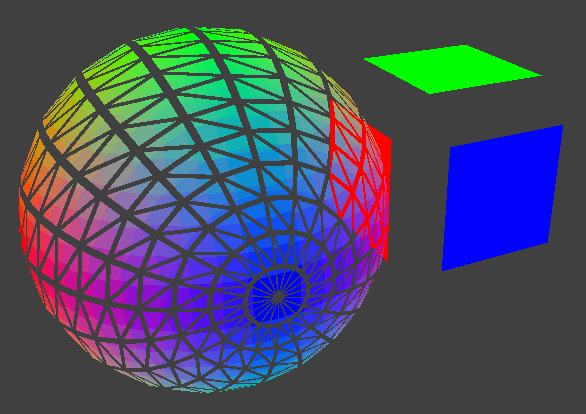
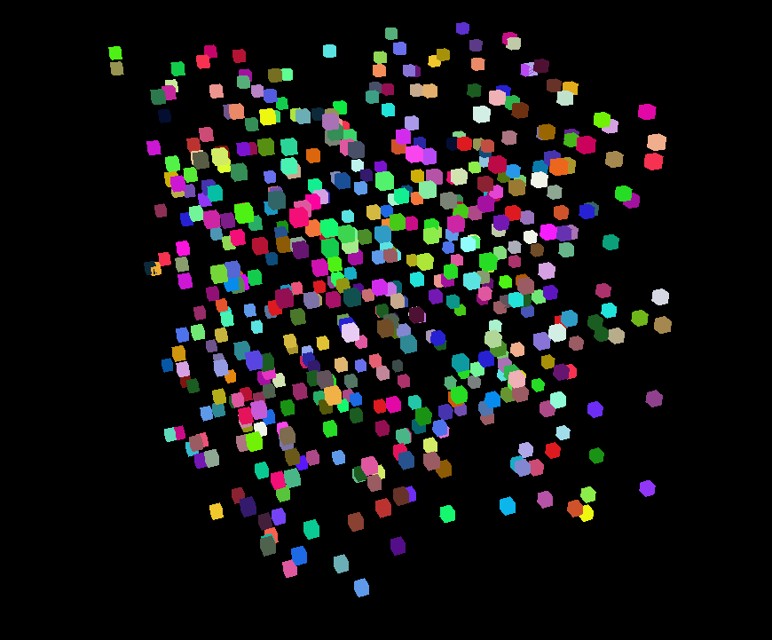
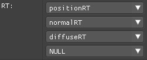
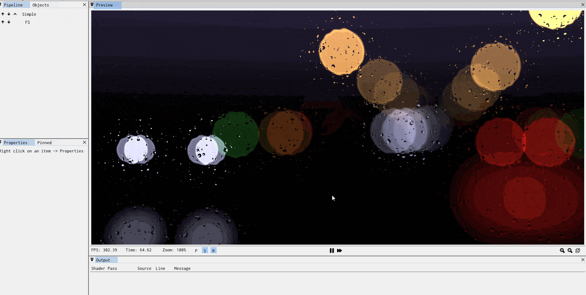

# SHADERed

SHADERed is a lightweight tool for creating and testing **HLSL and GLSL shaders**. It is easy to use,
open source, cross-platform (runs on Windows & Linux - HLSL shaders work on both OSes) and -frequently updated with new features.


## Features

### Shader debugger
Shader debugger is the newest addition to SHADERed. It is simple to use - you just pause the preview and select the pixel that you are interested in. After starting the debug process, you will be able to:
* step through your shader code line by line
* place breakpoints
* see list of all variables and their values


### Compute & geometry shaders
You are not limited to vertex and pixel shaders. SHADERed also has support for compute & geometry
shaders. To use GS, enable it in the shader pass' properties and set the path to your shader. You can create advanced
animations and effects using geometry shaders.
<p align="center">
    
</p>

You can also add **compute pass**es alongside normal shader passes:
<p align="center">
    
</p>

### Plugin API
You can develop your own SHADERed plugins (which I currently don't suggest since I still need to change a lot of things) or download and install some plugins.
To see the plugin API's potential, check out:
* [GodotShaders](https://github.com/dfranx/PluginGodotShaders) - adds support for Godot's shading language
* [ShadertoyImporter](https://github.com/dfranx/PluginShadertoy) - makes loading Shadertoy project a super easy task

You can download them through the [shadered.org](https://shadered.org/store/plugins.php) website too.

### See changes instantly
There are different ways to recompile your shaders. You can press F5 to manually recompile your shader, make it recompile shaders on file modify event (which then allows you to use external editors) or make it recompile changed and nonsaved shaders every 200ms:


### Render states
You can modify rasterizer, blend and depth-stencil states. Using these states you can: turn on wireframe mode,
disable depth test, use stencil buffer, disable culling, custom blending, etc... All these things help you achieve even more advanced effects.

### 3D models, textures (2D, 3D, cubemaps) & audio files
You can add music and create amazing visualizers!

Custom 3D models can also be easily added to the scene. You can also use built-in geometry objects such as cubes, spheres, planes,
full screen quads, etc...

Load textures from files and bind them to your shader. SHADERed also supports cubemaps & 3D textures.
<p align="center">
    
</p>

### Render textures
You can render your scene to render textures. You can bind multiple render textures to one shader pass. This can help with creating G-Buffer and similar things more easily. You can modify these render texture properties: size, format & clear color
<p align="center">
    
</p>

### Shader input variables
You can create your own variables and edit their values in real time. SHADERed also comes with lots of built-in 'system' shader variables (elapsed time, window size, various
view matrices, etc...).
You can also change shader variable value only for a specific 3D object - no programming required.
<p align="center">
    
</p>

### Zooming in & pausing
Do you need to zoom in on an area of your shader output? You can do that by holding ALT and selecting the area you want to zoom in. This can be useful when developing antialiasing shaders. It is also possible to pause the time
<p align="center">
    <br/>
    <em>Shader made by <a href="https://www.youtube.com/channel/UCcAlTqd9zID6aNX3TzwxJXg">The Art Of Code</a></em>
</p>

### And many more
Instancing, buffers, audio shaders, ability to have more than one camera, shader macros, pausing time, input layout/vertex attribute manager, export as image and image sequence, variable pointers, etc...

You can also check this list too: [link](https://shadered.org/features.php).

## Supporters
**Supporter(s):**
  * [Hugo Locurcio](https://hugo.pro)
  * Senthil Kumaran Rajasekaran
  * [Vladimir Alyamkin](https://alyamkin.com/)
  * [Wogos Media](http://theWogos.com/)

## Support
Support the development of this project on Patreon: [](https://www.patreon.com/dfranx)

You can support the development of this project via **PayPal**: [](https://paypal.me/dfranx) 

My e-mail address for businesses (or if you just want to contact me):
**contact at shadered dot org**

## Binaries
You can download precompiled binaries through the [Releases](https://github.com/dfranx/SHADERed/releases) page or you can use the [shadered.org](https://shadered.org/) website.

### Install using Scoop (Windows)

On Windows, you can use [Scoop](https://scoop.sh) to install SHADERed:

```text
scoop bucket add extras
scoop install shadered
```

### Install using Flatpak (Linux)

SHADERed is available on
[Flathub](https://flathub.org/apps/details/org.shadered.SHADERed). After setting
up Flatpak, you can install it by entering the following commands in a terminal:

```text
flatpak remote-add --if-not-exists flathub https://flathub.org/repo/flathub.flatpakrepo
flatpak install org.shadered.SHADERed
```

Note that the Flatpak version runs in a sandbox and some features may not work
correctly yet. Please report Flatpak-specific issues
[here](https://github.com/flathub/org.shadered.SHADERed/issues).

## Building
First clone the project & submodules:
```
git clone https://github.com/dfranx/SHADERed.git
cd SHADERed
git submodule update --init
```

### Linux
Install all the libraries that are needed:
```
# Ubuntu
sudo apt install libsdl2-dev libsfml-dev libglew-dev libglm-dev libgtk-3-dev
# Fedora
sudo dnf install SFML-devel glm-devel glew-devel SDL2-devel gtk3-devel
```

Build:
```
cmake .
make
```

**NOTE:** If you want immediate mode and related features, turn on BUILD_IMMEDIATE_MODE flag.
```
cmake -DBUILD_IMMEDIATE_MODE=ON .
make
```

**NOTE:** If you dont have SFML 2.5 installed on your machine, run these commands:
```
cmake -DUSE_FINDSFML=ON .
make
```

If you would like to perform an out-of-source build, do the following:
```
mkdir build
cd build
cmake .. # or, if SFML 2.5 is not installed, cmake -DUSE_FINDSFML=ON ..
make
```

Run:
```
./bin/SHADERed
```

### macOS
**NOTE: macOS is not officially supported by me + some features are not supported on macOS**

Install all the libraries that are needed:

```sh
brew install sdl2 sfml glew glm
```

Build:

```sh
mkdir build
cd build
cmake ../
make -j8
```

> **Note:** If you're building on a macOS version prior to 10.15 (Catalina) you may need to update Xcode and create a symlink for the SDK:
> 
> ```
> ln -s "$(xcrun --sdk macosx --show-sdk-path)" "$(xcrun --sdk macosx --show-sdk-platform-path)/Developer/SDKs/MacOSX10.15.sdk"
> ```

Run:
```
./bin/SHADERed
```

### Windows
1. Install SDL2, SFML, GLEW & GLM through your favourite package manager (I recommend vcpkg)
2. Run cmake-gui and set CMAKE_TOOLCHAIN_FILE variable (and turn on BUILD_IMMEDIATE_MODE flag if you want to have immediate mode and related features)
3. Press Configure and then Generate if no errors occured
4. Open the .sln and build the project!

## Tutorial
Don't know how or where to start? The debugger is confusing? Want to create your own shader or custom SHADERed theme? Visit [TUTORIAL.md](TUTORIAL.md) to see
detailed steps on how to do these things.

## Used by
[](https://www.arkaos.com/)

[](https://www.theWogos.com/)

## Screenshots

    <em>Shader made by <a href="https://www.youtube.com/channel/UCcAlTqd9zID6aNX3TzwxJXg">The Art Of Code</a></em>


Send your own screenshots [here](https://github.com/dfranx/SHADERed/issues/8)!

## Dependencies
This project uses:
 - [assimp/assimp](https://github.com/assimp/assimp)
 - [KhronosGroup/glslang](https://github.com/KhronosGroup/glslang)
 - [ocornut/imgui](https://github.com/ocornut/imgui/tree/docking) (docking + tables branch)
 - [juliettef/imgui_markdown](https://github.com/juliettef/imgui_markdown)
 - [BalazsJako/ImGuiColorTextEdit](https://github.com/BalazsJako/ImGuiColorTextEdit)
 - [benhoyt/inih](https://github.com/benhoyt/inih)
 - [zeux/pugixml](https://github.com/zeux/pugixml)
 - [dfranx/ShaderExpressionParser](https://github.com/dfranx/ShaderExpressionParser)
 - [KhronosGroup/SPIRV-Cross](https://github.com/KhronosGroup/SPIRV-Cross)
 - [KhronosGroup/SPIRV-Headers](https://github.com/KhronosGroup/SPIRV-Headers)
 - [KhronosGroup/SPIRV-Tools](https://github.com/KhronosGroup/SPIRV-Tools)
 - [dfranx/SPIRV-VM](https://github.com/dfranx/SPIRV-VM)
 - [rAzoR8/SpvGenTwo](https://github.com/rAzoR8/SpvGenTwo)
 - [nothings/stb](https://github.com/nothings/stb)
 - [aiekick/ImGuiFileDialog](https://github.com/aiekick/ImGuiFileDialog)

Some of the examples in the `examples` directory were taken from AMD's Render Monkey, so credits to AMD.

## LICENSE
SHADERed is licensed under MIT license. See [LICENSE](./LICENSE) for more details.
