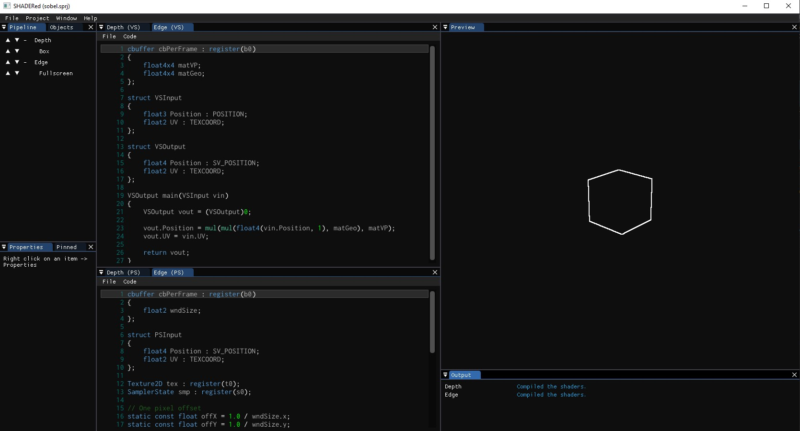

# SHADERed

SHADERed is a lightweight tool for creating and testing **HLSL and GLSL shaders**. It is easy to use,
open source, cross-platform (runs on Windows, Linux and soon macOS - even HLSL shaders work on every OS too) and frequently updated with new features. It has many **features** that the competition
is lacking.


## Sponsors
No one :(

Contact: **dfranx00 at gmail dot com**

## Support
Support the development of this project on Patreon: [](https://www.patreon.com/dfranx)

You can support the development of this project via **PayPal**: [PayPal link](https://paypal.me/dfranx) 

This is my e-mail address for businesses or if you just want to contact me:
**dfranx00 at gmail dot com**

## Features

### See changes instantly
You can press F5 (or whatever shortcut you have set in the options) to see you changes:


Don't want to press F5 constantly? Using an external editor and not the built-in one? Turn on
the `"Recompile shader on file change"` flag in the options and once you make changes to the
file, SHADERed will instantly detect that and recompile your shaders:


Want to see how a certain object affects your scene? Grab the object and scale, rotate and move it
around the scene:


### Geometry shaders
You are not limited to vertex and pixel shaders. SHADERed also has support for geometry
shaders. Just enable GS in your shader pass and set the path to your shader. Create advanced
animations and effects using geometry shaders.
<p align="center">
    
</p>

### Render states
You can modify rasterizer, blend and depth-stencil state. Using these states you can: turn on wireframe mode,
disable depth test, use stencil buffer, disable culling, custom blending, etc... All those things help you achieve even more advanced effects.

Heres an example of rasterizer state properties:
<p align="center">
    
</p>

### Audio files
Load a song and create amazing music visualizers!
<p align="center">
    
</p>

### Loading 3D models
You can easily add your custom 3D models to the scene. You can also add built-in geometry objects such as cubes, spheres, planes,
full screen quads, etc...

### Textures
Load textures from files and bind them to your shader. SHADERed also supports cubemaps.
<p align="center">
    
</p>

### Render textures
You can render your results to a window or a custom render texture. You can bind multiple render textures
to one shader pass. It helps you create things such as G-Buffer more easily and in only one shader pass. 
<p align="center">
    
</p>

### Shader input variables
You can create your own variables and edit their values in real time. SHADERed also comes with lots of built-in 'system' shader variables (elapsed time, window size, various
view matrices, etc...).


You can also pin those variables. All pinned variables (from different shader passes) will be visible on
a single window and easily accessible. You can edit them there quickly and see your results instantly.
<p align="center">
    
</p>

You can change a shader variable value only for a specific 3D model/geometry item. No programming is required.
You can change multiple variables for each item in the scene before rendering it.
<p align="center">
    
</p>

### Workspace
You can modify SHADERed workspace however you want to thanks to Omar Cornut's great work on
[Dear ImGUI's docking branch](https://github.com/ocornut/imgui/tree/docking), which implements window docking.
<p align="center">
    
</p>

### Code editor
SHADERed has a built-in code editor. The code editor features a very basic version of code predictions.
It is called Smart predictions and it will be updated and improved over time. It also has very basic version
of autocompletion (inserts/removes brackets) and automatic indenting. All of these features can be turned on/off
in options. Theres also an option to convert your tabs to spaces. The code editor will be improved over time.

**You are not forced to use the built-in code editor (and you probably shouldn't use it right now to avoid some
annoying bugs)**. You can seperately run your favourite code editor and SHADERed. 
**Modify your shaders in the code editor of your choice and just save the file - SHADERed will automatically
recompile the shaders for you**.

### Error markers
Error markers help you locate and identify your shader errors more easily. Hover over a line with an error
to see the message or just check it in the "Output" window.
<p align="center">
    
</p>

### Custom themes
You can create your own theme SHADERed theme. Modify ImGuiStyle members in an *.ini file. SHADERed themes allow you to
customize everything including text editor color palette. SHADERed comes with a few built-in themes. I am bad at designing 
so please submit your own themes!

Want to create your own theme but don't know how? Visit [TUTORIAL.md](./TUTORIAL.md).

### Custom templates
You can create your own custom templates. SHADERed comes with a GLSL, HLSL and HLSL deferred rendering template.
Templates help you start developing shaders quickly. To create your own project template, paste your project
directory in /templates directory and name your project file `template.sprj`. You have to reopen SHADERed if it was
already running to see the template under `File -> New`. A menu item for creating a template will
have the same text as the parent directory of the template.

### And many more
Variable pointers, shader macros, etc...

## TODO
There are also some features that I am looking to implement:
 - multiple cameras
   - this feature would allow you to render same scene from multiple angles
 - node shader editor that can export to GLSL and HLSL
 - shader & theme "store"
   - a place where you can upload your shaders or themes and see other peoples creations
 - "Export as DirectX/OpenGL application" option (.cpp file)
-  compute and tesselation shaders
 - render your shader to a video file
 - buffers read from file or built using in-app buffer editor
 - magnifier tool & pixel inspector
 - text geometry
 - debugger
 - built-in FXAA


Except those large features, I am also planning to do some small QoL changes:
 - feature such as "Change variables" for items but for changing textures -> render textured 3D models easily (have an option to set up everything automatically)
 - add "Advanced" menu that allows user to modify (at least some) system variables when taking screenshot/video
 - cubemap preview
 - click on cubemap, audio, 3d model, texture and render texture preview should open a preview window
 - recompile the shader after we change shader path in a shader pass
 - when adding a shader pass, decompile the shader and detect the input layout + input variables
 - when loading a texture it might not be loaded if not bound to any shader pass
 - indent controls after fps in the status bar - bad UX and UI
 - ability to change warning, message and error text colors
 - add a */ImGuiWindowFlags_UnsavedDocument to Pipeline (and add '\*' to window titlebar) after changing anything in the project (+ popup window on exit)
 - PipelineUI::GetSelectedShaderPass() -> add Geometry and other options under "Create" menu item in GUIManager
 - use an icon font instead of buttons like "U", "D", etc...
 - toolbar (a bar with all the important tools (icons))
 - shift+drag with right click to move ArcBallCamera focus point
 - add an option to disable certain shader pass
 - error marker should "stick" on the line when new lines are added
 - find and replace in code editor
 - right click in code editor
 - improve the overall code (enum for shader type, etc...)
 - fix memory leaks
 - undo/redo adding shader items
 - languages (english, croatian, etc...)
 - switch from sdl to sfml (?)
 - dragging items from one pass to another, duplicating them, etc...

## Binaries
To download already precompiled binaries, you can visit [Release](https://github.com/dfranx/SHADERed/releases) page and download
latest stable binary release.

## Building
First clone the project & submodules:
```
git clone https://github.com/dfranx/SHADERed.git
git submodule init
git submodule update
```

### Linux
Install all the libraries that are needed:
```
sudo apt install libsdl2-dev libsfml-dev libglew-dev libglm-dev libassimp-dev libgtk-3-dev
```

Build:
```
cmake .
make
```

Run:
```
./bin/SHADERed
```

### Windows
1. Install SDL2, SFML, GLEW, GLM, ASSIMP through your favourite package manager (I recommend vcpkg)
2. Run cmake-gui and set CMAKE_TOOLCHAIN_FILE variable
3. Press Configure and then Generate if no errors occured
4. Open the .sln and build the project!

## Tutorial
Don't know how or where to start? Want to create your own shader or custom SHADERed theme? Visit [TUTORIAL.md](TUTORIAL.md) to see
detailed steps on how to do so.

## Dependencies
This project uses:
 - [imgui](https://github.com/ocornut/imgui/tree/docking) (docking branch)
 - [ImGuiColorTextEdit](https://github.com/BalazsJako/ImGuiColorTextEdit)
 - [pugixml](https://github.com/zeux/pugixml)
 - [inih](https://github.com/benhoyt/inih)
 - [KhronosGroup/glslangValidator](https://github.com/KhronosGroup/glslang)
 - [KhronosGroup/SPIRV-Cross](https://github.com/KhronosGroup/SPIRV-Cross)
 - [gulrak/filesystem](https://github.com/gulrak/filesystem)
 - [nothings/stb](https://github.com/nothings/stb)
 - [mlabbe/nativefiledialog](https://github.com/mlabbe/nativefiledialog)

Some of the examples in the `examples` directory were taken from AMD's Render Monkey, so credits to AMD.

## Screenshots



Send your own screenshots!

## Credits
Huge thanks to Omar Cornut, go follow him on [twitter](https://twitter.com/ocornut) or support him on [patreon](https://www.patreon.com/imgui).
I dont think SHADERed would exist without his awesome library [Dear ImGUI](https://github.com/ocornut/).
I came up with the shader editor idea when I stubmled upon a [ImGuiColorTextEdit](https://github.com/BalazsJako/ImGuiColorTextEdit).
So big thanks to BalazsJako for his amazing creation. Also, thanks to Raph Levien for the [Inconsolata](https://fonts.google.com/specimen/Inconsolata) font
and Christian Robertson for [Roboto Mono](https://fonts.google.com/specimen/Roboto+Mono?selection.family=Roboto+Mono).

Thanks to Khronos for creating [glslangValidator](https://github.com/KhronosGroup/glslang) and [SPIRV-Cross](https://github.com/KhronosGroup/SPIRV-Cross) tools.
Those programs allowed me to add support for GLSL. Thanks to AMD and their RenderMonkey examples. Credits to creators of the
themes that SHADERed comes with. Those themes and their creators can be found [here](https://github.com/ocornut/imgui/issues/707).

## LICENSE
SHADERed is licensed under MIT license. See [LICENSE](./LICENSE) for more details.
