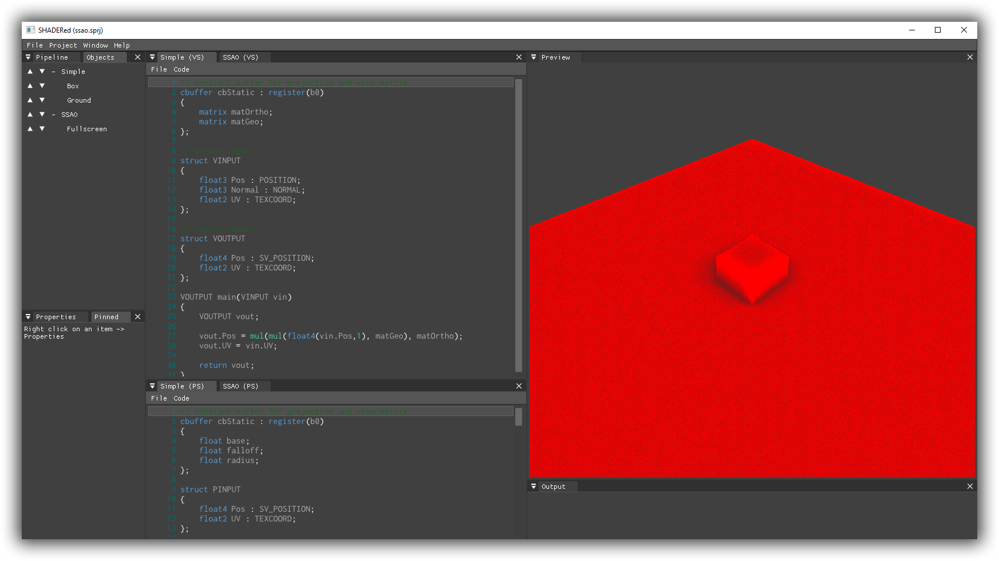
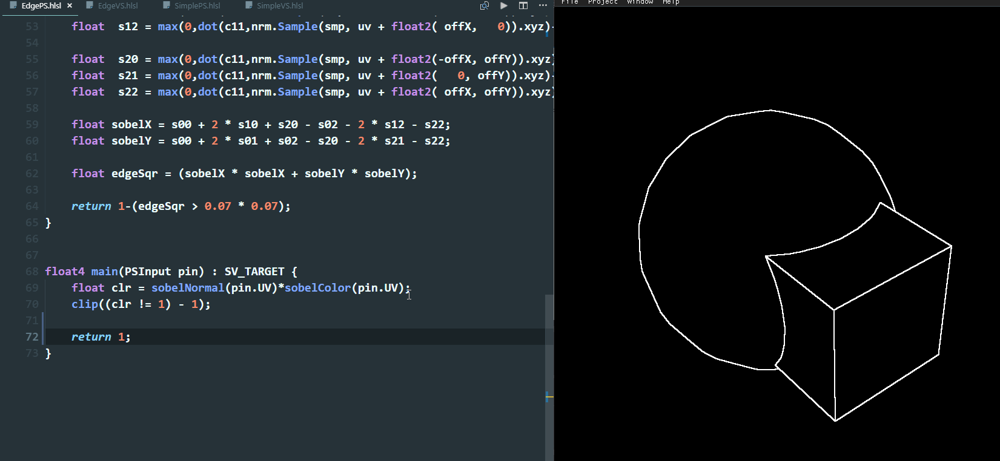
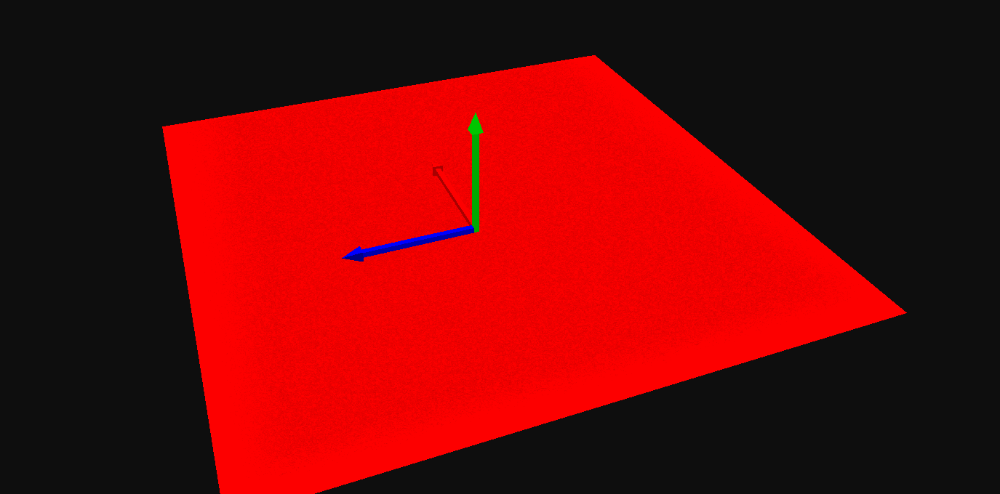
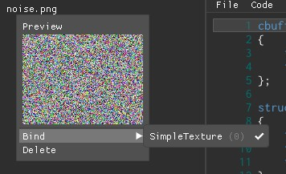
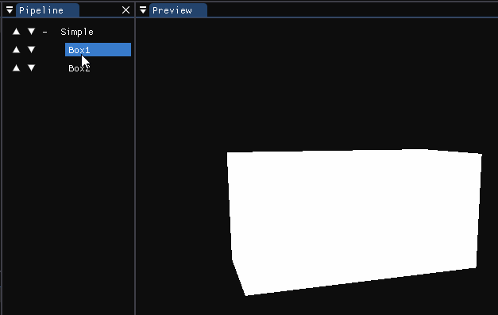
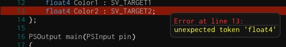
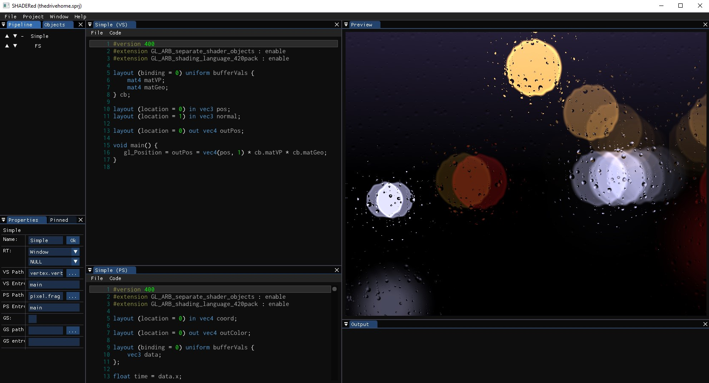

# SHADERed

SHADERed is a lightweight tool for creating and testing **HLSL and GLSL shaders**. It is easy to use,
open source, cross-platform (runs on Windows & Linux - HLSL shaders work on both OS) and frequently updated with new features.

**[13.10.2019] Development slowed down due to me working on [ShaderDebugger](https://github.com/dfranx/ShaderDebugger)**



## Partners / Sponsors
...

Contact: **dfranx00 at gmail dot com**

## Supporters
**Silver supporter(s):**
[Hugo Locurcio](https://github.com/Calinou)


## Support
Support the development of this project on Patreon: [](https://www.patreon.com/dfranx)

You can support the development of this project via **PayPal**: [](https://paypal.me/dfranx) 

My e-mail address for businesses (or if you just want to contact me):
**dfranx00 at gmail dot com**

## Features

### Compute & geometry shaders
You are not limited to vertex and pixel shaders. SHADERed also has support for compute & geometry
shaders. To use GS enable it in your shader pass' properties and set the path to your shader. You can create advanced
animations and effects using geometry shaders.
<p align="center">
    
</p>

You can also add **compute pass**es alongside shader passes:
<p align="center">
    
</p>

### See changes instantly
SHADERed offers different ways of recompiling your changed shaders. You can press
F5 to manually recompile your shader, make it recompile shaders on file modify event (this also allows
you to use external editors with ease) or make it recompile shaders every 200ms:


Since the built-in text editor is buggy in the latest version, you can turn on
the `"Recompile shader on file change"` and `"Open shaders in an external editor"` options.
Open the shader files in an external editor & once you make changes to the file, SHADERed will instantly
detect them and recompile your shaders:


Want to see how a certain object affects your scene? Grab the object and scale, rotate and move it
around the scene:


### Render states
You can modify rasterizer, blend and depth-stencil states. Using these states you can: turn on wireframe mode,
disable depth test, use stencil buffer, disable culling, custom blending, etc... All those things help you achieve even more advanced effects.

### 3D models, textures (2D, 3D, cubemaps) & audio files
You can add music and create amazing visualizers!

Custom 3D models can also be easily added to the scene. You can also use built-in geometry objects such as cubes, spheres, planes,
full screen quads, etc...

Load textures from files and bind them to your shader. SHADERed also supports cubemaps & 3D textures.
<p align="center">
    
</p>

### Render textures
You can render your scene to custom render textures. You can bind multiple render textures
to one shader pass. This helps with create G-Buffers and similar things more easily. 
<p align="center">
    
</p>

### Shader input variables
You can create your own variables and edit their values in real time. SHADERed also comes with lots of built-in 'system' shader variables (elapsed time, window size, various
view matrices, etc...).


You can also change shader variable value only for a specific 3D object. No programming is required.
<p align="center">
    
</p>

### Zooming in & pausing
Working on an antialiasing shader? You can zoom in and inspect edges of 3D objects.
Hold ALT and select an area that you want to look at in more detail
<p align="center">
    <br/>
    <em>Shader made by <a href="https://www.youtube.com/channel/UCcAlTqd9zID6aNX3TzwxJXg">The Art Of Code</a></em>
</p>

### Workspace
You can modify SHADERed workspace however you want to thanks to Omar Cornut's great work on
[Dear ImGUI's docking branch](https://github.com/ocornut/imgui/tree/docking), which implements window docking.

### Error markers
The built-in code editor has error markers. They help you locate and identify your shader errors more easily.
Hover over a line with an error to see the message or just check it in the "Output" window.
<p align="center">
    
</p>

**NOTE: You are not forced to use the built-in code editor** (and you probably shouldn't use it right now to avoid some
annoying bugs).

### Custom themes
You can create your own SHADERed theme. SHADERed themes allow you to
customize everything. SHADERed comes with a few built-in themes. I am bad at designing 
so please submit your custom themes!

Want to create your own theme but don't know how? Visit [TUTORIAL.md](./TUTORIAL.md).

### Custom templates
You can create your own custom templates. SHADERed comes with a GLSL, HLSL and HLSL deferred rendering template.
Templates help you start developing shaders quickly. To create your own project template, paste your project
directory in the "templates" directory and name your project file `template.sprj`. You have to reopen SHADERed if it was
already running to see the template under `File -> New`. A menu item for creating a template will
have the same text as the parent directory of the template.

### And many more
Instancing, buffers, audio shaders, ability to have more than one camera, shader macros, pausing time, input layout/vertex attribute manager, export as image and image sequence, variable pointers, etc...
Check out the list of features that I want to implement in near future: [TODO.md](./TODO.md)

## Binaries
You can download precompiled binaries here: [Releases](https://github.com/dfranx/SHADERed/releases)

## Building
First clone the project & submodules:
```
git clone https://github.com/dfranx/SHADERed.git
git submodule init
git submodule update
```

### Linux
Install all the libraries that are needed:
```
# Ubuntu
sudo apt install libsdl2-dev libsfml-dev libglew-dev libglm-dev libassimp-dev libgtk-3-dev
# Fedora
sudo dnf install assimp-devel SFML-devel glm-devel glew-devel SDL2-devel gtk3-devel
```

Build:
```
cmake .
make
```

**NOTE:** If you dont have SFML 2.5 installed on your machine, run these commands:
```
cmake -DUSE_FINDSFML=ON .
make
```

Run:
```
./bin/SHADERed
```

### Windows
1. Install SDL2, SFML, GLEW, GLM, ASSIMP through your favourite package manager (I recommend vcpkg)
2. Run cmake-gui and set CMAKE_TOOLCHAIN_FILE variable
3. Press Configure and then Generate if no errors occured
4. Open the .sln and build the project!

## Tutorial
Don't know how or where to start? Want to create your own shader or custom SHADERed theme? Visit [TUTORIAL.md](TUTORIAL.md) to see
detailed steps on how to do so.

## Used by
[](https://www.arkaos.com/)

## Screenshots

    <em>Shader made by <a href="https://www.youtube.com/channel/UCcAlTqd9zID6aNX3TzwxJXg">The Art Of Code</a></em>


Send your own screenshots [here](https://github.com/dfranx/SHADERed/issues/8)!

## Dependencies
This project uses:
 - [ocornut/imgui](https://github.com/ocornut/imgui/tree/docking) (docking branch)
 - [BalazsJako/ImGuiColorTextEdit](https://github.com/BalazsJako/ImGuiColorTextEdit)
 - [zeux/pugixml](https://github.com/zeux/pugixml)
 - [benhoyt/inih](https://github.com/benhoyt/inih)
 - [KhronosGroup/glslangValidator](https://github.com/KhronosGroup/glslang)
 - [KhronosGroup/SPIRV-Cross](https://github.com/KhronosGroup/SPIRV-Cross)
 - [gulrak/filesystem](https://github.com/gulrak/filesystem)
 - [nothings/stb](https://github.com/nothings/stb)
 - [mlabbe/nativefiledialog](https://github.com/mlabbe/nativefiledialog)

Some of the examples in the `examples` directory were taken from AMD's Render Monkey, so credits to AMD.

## LICENSE
SHADERed is licensed under MIT license. See [LICENSE](./LICENSE) for more details.
