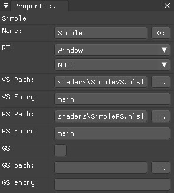
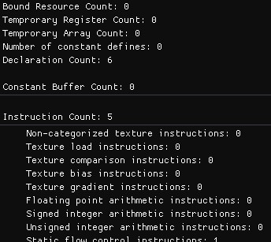

# SHADERed

SHADERed is a lightweight tool for creating and testing your HLSL and GLSL shaders. It is easy to use,
open source and frequently updated with new features. SHADERed is great for fast shader development.
Hit one key and see your new shader in action immediately. It currently only works on Windows (not
tested on Wine).

SHADERed has many **features** such as: rendering to multiple render textures simultaneously,
loading WAVEFRONT (.obj) models, loading custom textures, custom themes, 'smart' predictions,
geometry shaders, create your own shader input variables and pin them to a window to edit
them easily, and many more great features...

Feel free to contact me and suggest some missing feature you would like me to implement.


## Features

### Dynamic workspace
You can modify SHADERed workspace to your own needs thanks to Omar Cornut's great work on
Dear IMGUI's docking branch, which implements window docking. Your workspace configuration
will be saved to a file so that on next startup it looks just like you made it to look.
<p align="center">
    
</p>

### Shader Pass
You need to create a shader pass to apply an effect to a 3D model or a texture. A shader pass
is just a set of shaders. A shader pass can only have one pixel, vertex and geometry shader but
you can have multiple shader passes.
You can have as many 3D objects or render states that you want to in a single shader pass. All shader
passes and 3D objects are part of a pipeline.
<p align="center">
    
    
</p>

### Render states
You can modify rasterizer, blend and depth-stencil state. Using these states you can: turn on wireframe mode,
disable depth test, use stencil buffer, disable cull, custom blending, etc... All those things help you achieve even more advanced effects.

Heres an example of rasterizer state properties:
<p align="center">
    
</p>

### See changes instantly
Modified your shader? Just hit F5 key (or whatever shortcut you have set) and see your results almost
immediately! There is no need to restart your application.


### Geometry shaders
You are not limited to vertex and pixel shaders. SHADERed also has support for geometry
shaders. Just enable GS in your shader pass and set the path to your shader. Create advanced
animations and effects for your 3D models using geometry shaders.
<p align="center">
    
</p>

### Code editor
SHADERed has a built-in code editor. The code editor features a very basic version of code predictions.
It is called Smart predictions and it will be updated and improved over time. It also has very basic version
of autocompletion (inserts/removes a bracket) and automatic indenting. All of these features can be turned on/off
in options. Theres also an option to convert your tabs to spaces. The code editor will be improved over time.

You are not forced to use our code editor. You can run seperately your favourite code editor and SHADERed. 
Modify your shaders in editor of your choice and just hit "Rebuild" in SHADERed.

### Loading .obj models
You can easily add your custom complex 3D models to scene. Only Wavefront .obj models are currently supported, but
you can expect formats to be supported in near future. You can also add built-in geometry (cubes, spheres, planes,
full screen quads, etc...).

### Textures
Load textures from files and bind them to your shader. SHADERed supports JPG, PNG,
DDS and BMP file format. Currently there is only a built-in sampler state. I plan to add customizable
sampler states in future. The sampler state is always bound to s0 register (in a shader pass which is
using a texture). SHADERed also supports cubemaps.
<p align="center">
    
</p>

### Render textures
You can render your results to a window or a custom render texture. You can bind multiple render textures
to one shader pass. It helps you create things such as G-Buffer more easily and in only one shader pass. 
<p align="center">
    
</p>

### Shader input variables
You can create your own variables and edit their values. Those variables will be sent to a shader using a
constant buffer. There are also a lot of built-in 'system' shader variables (elapsed time, window size, various
view matrices, etc...).


You can also pin those variables. All pinned variables (from different shader passes) will be visible on
one window. You can edit them there easily and see your results in real time.
<p align="center">
    
</p>

You can change a shader variable value only for a specific 3D model/geometry item. No programming is required.
Imagine passing a variable objColor with value (1,1,1,1) to a shader in a constant buffer. You can change that
variable's value before rendering an item:
<p align="center">
    
</p>


### Error markers
Error markers help you locate and identify your shader errors more easily. Hover over a line with an error
to see the message or just check it in the "Output" window. Error markers are currently only supported for 
HLSL but I am looking into implementing them for GLSL too (I just have to pipe the process output in GLSL2HLSL.cpp).
<p align="center">
    
</p>

### Shader stats
Don't know if your new shader has less instructions and is more optimized? Just check the stats page for your shader
in SHADERed. It shows you total number of instructions and number of specific instructions. This way you can see if your shader
really became more optimized or not:
<p align="center">
    
</p>

### Custom themes
You can create your own theme SHADERed theme. Modify ImGuiStyle members from an *.ini file. SHADERed themes allow you to
customize everything including text editor color palette. SHADERed comes with a few built-in themes. I am bad at designing 
so please submit your themes!

Want to create your own theme? Visit [TUTORIAL.md](./TUTORIAL.md) and see how to do so.

### Custom template
You can create your own custom templates. SHADERed comes with a GLSL, HLSL and HLSL deferred rendering template.
Templates help you start with already built base for your new project. To create your own project template, paste your project
directory in /templates directory and name your project file `template.sprj`. You have to reopen SHADERed if it was
already running to see the template under `File -> New`. A menu item for creating a template will
have same text as the parent directory of the template.

## TODO
There are also some features that I am looking to implement:
 - custom sampler states
 - more 3D model file formats
 - multiple cameras
   - this feature would allow you to render same scene from multiple angles
 - shader variable pointers
   - currently if you want to have same value in two shader passes you will have to enter it manually
 - shader flags
   - custom flags when compiling the shader
 - audio files
   - audio files would allow you to create music visualization
 - node shader editor that can export to GLSL and HLSL
 - shader & theme "store"
   - a place where you can upload your shaders or themes and see other peoples creations
 - "Export as DirectX/OpenGL application" option (.cpp file)
 - research tesselation and compute shaders and how to implement them
 - built-in antialiasing
 - render your shader to a video file
 - support #include and macros
 - hot reloading 
   - compile shaders every X seconds in background - discard if any error occured
 - performance mode (render only preview - hide UI)
 - inspect render target output pixels (show RGB values on hover over pixel)


Except those large features, I am also planning to do some small QoL changes:
 - find and replace in code editor
 - right click in code editor
 - when adding a shader pass decompile the shader and detect the input layout + input variables
 - PipelineUI::GetSelectedShaderPass() -> add Geometry and other options under "Create" menu item in GUIManager
 - recompile the shader after we change shader path in a shader pass
 - buffers read from file or built using in-app buffer editor
 - right click on an empty objects panel should open a context menu
 - ctrl + click -> select multiple items
 - bounding box around selected item + possible resize points on the bounding box
 - polished gizmo
 - add a */ImGuiWindowFlags_UnsavedDocument to Pipeline after changing anything in the project
 - cubemap preview
 - click on cubemap, texture and render texture preview should open a preview window
 - fix selecting items when user has a skybox in scene
 - use pointers to RTs in pipe::ShaderPass instead of names
 - remember collapsed items in a project
 - remember focused window in workspace.dat (worked before updating my imgui/docking clone)

## Support
Your support will help me continue the development of this program (and any other program
that I plan to develop in future). I will be a student in few months so any support is welcome
and helps me dedicate my time to these projects instead of having a part-time job.

You can support me on Patreon: [](https://www.patreon.com/dfranx)

But you can also support via PayPal: [](https://www.paypal.com/dfranx)


This is my e-mail address for businesses or if you just want to contact me:
**e-mail**

## Binaries
To get started you can visit [Release](https://github.com/dfranx/SHADERed/releases) page and download
latest stable binary release. If you want to compile the program yourself, install [vcpkg](https://github.com/Microsoft/vcpkg)
or any package manager. Then run following command: ```vcpkg install directxtex```. If you don't have
a C++ package manager, download and compile [DirectXTex](https://github.com/Microsoft/directxtex) library manually. 
You also have to download, compile and link [MoonLight](https://github.com/dfranx/MoonLight) - a Direct3D 11 wrapper.
Tutorial is written in the [README.md](https://github.com/dfranx/MoonLight/README.md) file of the MoonLight repo.

## Usage
Don't know how or where to start? Want to create your own shader or custom SHADERed theme? Visit [TUTORIAL.md]() to see
detailed steps on how to do so.

## Dependencies
This library uses:
 - DirectX 11
 - DirectXMath
 - [imgui](https://github.com/ocornut/imgui/tree/docking) (docking branch)
 - [ImGuiColorTextEdit](https://github.com/BalazsJako/ImGuiColorTextEdit)
 - [pugixml](https://github.com/zeux/pugixml)
 - [MoonLight](https://github.com/dfranx/MoonLight)
 - [inih](https://github.com/benhoyt/inih)
 - [DirectXTex](https://github.com/microsoft/DirectXTex)
 - [KhronosGroup/glslangValidator](https://github.com/KhronosGroup/glslang)
 - [KhronosGroup/SPIRV-Cross](https://github.com/KhronosGroup/SPIRV-Cross)

Some of the examples were taken from AMDs Render Monkey, credits to AMD!

## Screenshots


Send your best screenshots!

## Credits
Huge thanks to Omar Cornut, go follow him on [twitter](https://twitter.com/ocornut) or support him on [patreon](https://www.patreon.com/imgui).
I dont think SHADERed would exist without his awesome library [Dear ImGUI](https://github.com/ocornut/).
list of all the library creators. I came up with the shader editor idea when I stubmled upon a [ImGuiColorTextEdit](https://github.com/BalazsJako/ImGuiColorTextEdit).
So big thanks to BalazsJako for his amazing creation. Also, thanks to Raph Levien for the [Inconsolata](https://fonts.google.com/specimen/Inconsolata) font.

Thanks to Khronos for creating [glslangValidator](https://github.com/KhronosGroup/glslang) and [SPIRV-Cross](https://github.com/KhronosGroup/SPIRV-Cross) tools.
Those programs allowed me to add support for GLSL. Thanks to AMD and their RenderMonkey examples. Credits to creators of the
themes that SHADERed comes with. Those themes and their creators can be found [here](https://github.com/ocornut/imgui/issues/707).

## LICENSE
SHADERed is licensed under MIT license. See [LICENSE](./LICENSE) for more details.