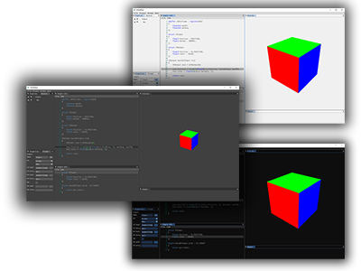

# SHADERed

SHADERed is a lightweight tool for creating and testing your HLSL and GLSL shaders. It is easy to use,
open source and frequently updated with new features. SHADERed is great for fast shader development.
Hit one key and see your new shader in action immediately. It currently only works on Windows.

SHADERed has many **features** such as: rendering to multiple render targets simultaneously,
loading WAVEFRONT (.obj) models, loading custom textures, custom themes, 'smart' predictions,
geometry shaders, create your own shader input variables and pin them to a window to edit
them easily, and many more great features...

Feel free to contact me and suggest some missing feature you would like me to implement.

## Features

### Dynamic workspace
text

### Shader Pass
text

### See changes instantly
text

### Geometry shaders
text

### 'Smart' predictions
text

### Loading .obj models
text

### Textures
text

### Render targets
text

### Shader input variables
text

### Error markers
Currently only supported for HLSL.
text

### Shader stats
text

### Custom themes
text

### Custom template
text

## TODO
There are also some features that I am looking to implement:
 - custom sampler states
 - more 3D model file formats
 - multiple cameras
   - this feature would allow you to render same scene from multiple angles
 - shader variable pointers
   - currently if you want to have same value in two shader passes you will have to enter it manually
 - shader flags
   - custom flags when compiling the shader
 - audio files
   - audio files would allow you to create music visualization
 - node shader editor that can export to GLSL and HLSL
 - shader "store"
   - a place where you can upload your shaders and see other peoples creations
 - "Export as DirectX/OpenGL application" option (.cpp file)
 - research tesselation and compute shaders and how to implement them
 - built-in antialiasing
 - render your shader to a video file
 - support #include and macros
 - hot reloading 
   - compile shaders every X seconds in background - discard if any error occured
 - performance mode (render only preview - hide UI)
 - inspect render target output pixels (show RGB values on hover over pixel)

Except those large features, I am also planning to do some small QoL changes:
 - find and replace in code editor
 - right click in code editor
 - when adding a shader pass decompile the shader and detect the input layout + input variables
 - PipelineUI::GetSelectedShaderPass() -> add Geometry and other options under "Create" menu item in GUIManager
 - recompile the shader after we change shader path in a shader pass
 - buffers read from file or built using in-app buffer editor
 - GLSL error markers & error messages
 - right click on an empty objects panel should open a context menu
 - ctrl + click -> select multiple items
 - bounding box around selected item + possible resize points on the bounding box
 - polished gizmo
 - dont reposition code editor after renaming shader pass
 - cubemap preview
 - click on cubemap, texture and render texture preview should open a preview window
 - fix selecting items when user has a skybox in scene
 - use pointers to RTs in pipe::ShaderPass instead of names
 - remember collapsed items in a project
 - errors in GLSL shader file cause SHADERed to freeze

## Support
Your support will help me continue the development of this program (and any other program
that I plan to develop in future). I will be a student in few months so any support is welcome.

You can support me on: **Patreon**, **PayPal**

This is my e-mail address for businesses or if you just want to contact me:
**e-mail**

## Binaries
Link

## Usage
TUTORIAL.md link

## Dependencies
This library uses:
 - DirectX 11
 - [imgui](https://github.com/ocornut/imgui/tree/docking) docking branch - huge thanks to Omar Cornut, go follow him on [twitter](https://twitter.com/ocornut) or support him on [patreon](https://www.patreon.com/imgui)
 - [ImGuiColorTextEdit](https://github.com/BalazsJako/ImGuiColorTextEdit) - also huge thanks to BalazsJako
 - [pugixml](https://github.com/zeux/pugixml)
 - [MoonLight](https://github.com/GeneralNote/MoonLight)
 - [inih](https://github.com/benhoyt/inih)
 - Khronos/glslangValidator
 - Khronos/SPIRV-Cross

Some of the examples were taken from AMDs Render Monkey, credits to AMD!

## Screenshots
images

## Credits
list of all the library creators
\+ inconsolata.ttf
\+ Khronos
\+ AMD

## LICENSE
SHADERed is licensed under MIT license. See [LICENSE](./LICENSE) for more details.