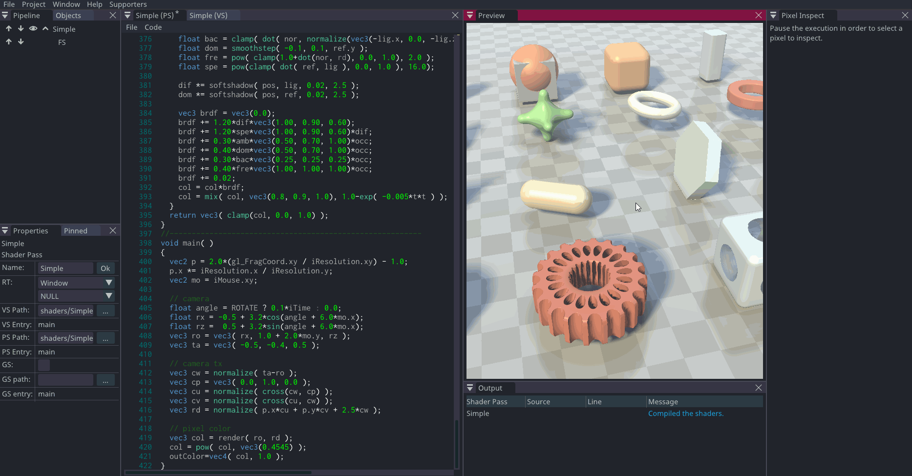
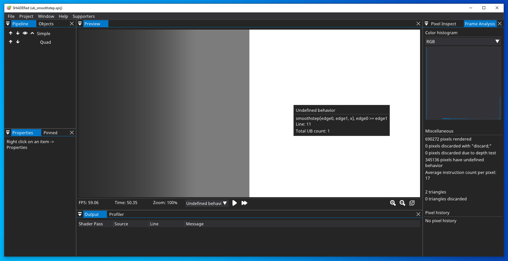
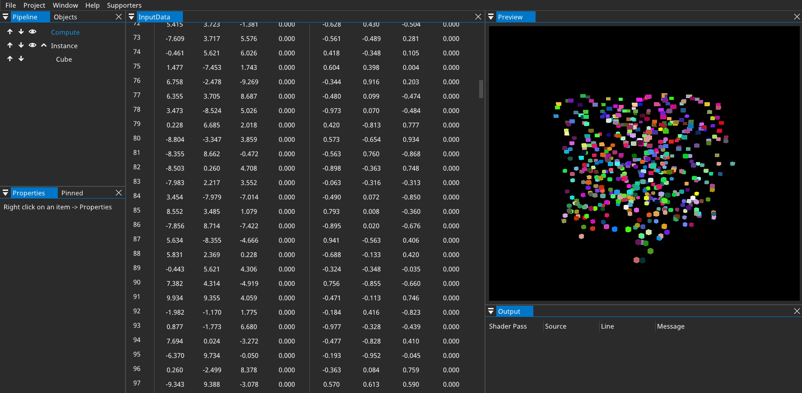
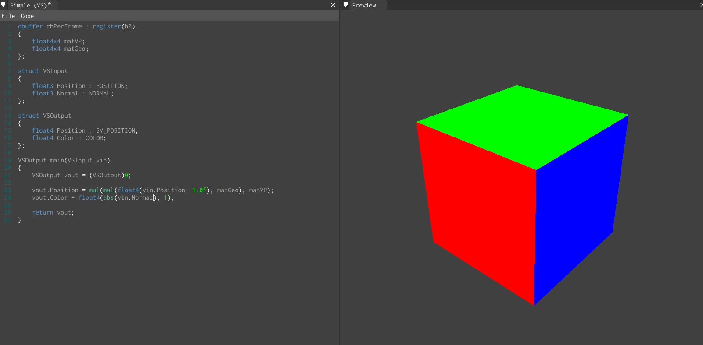
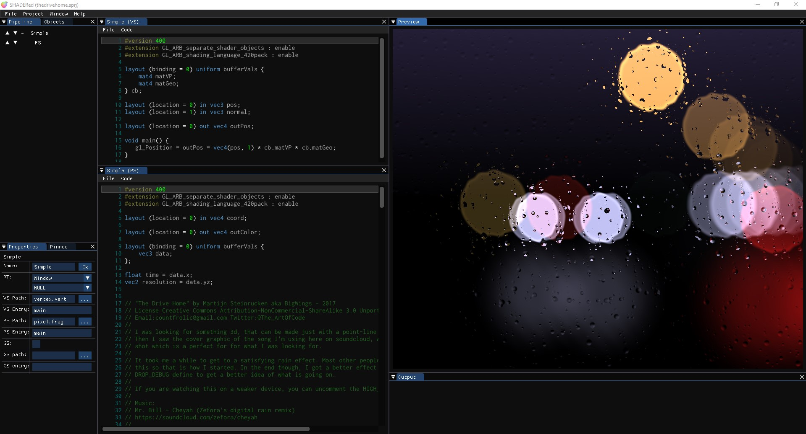

# SHADERed

SHADERed is a lightweight tool for writing and debugging shaders. It is easy to use,
open source, cross-platform (runs on Windows, Linux & [Web](https://shadered.org/template)).


#### Table of Contents
* [Features](#features)
* [Sponsors](#sponsors)
* [Supporters](#supporters)
* [Binaries](#binaries)
* [Building](#building)
* [Tutorials](#tutorials)
* [Screenshots](#screenshots)
* [Dependencies](#dependencies)
* [License](#license)

## Features

### Shader debugger
Shader debugger lets you easily find bugs in your shader code. It is simple to use - you just need to pause
the preview and select the pixel that you want to debug. After starting the debugger,
you will be able to:
* step through your shader code line by line
* run immediate expressions
* add watches
* place (conditional) breakpoints
* see list of all variables and their values
* hover over expressions and see their value



With SHADERed, you can debug vertex, geometry, tessellation control, pixel and compute shaders.

Thanks to SHADERed, you can now also debug shaders in Visual Studio Code with an extension. Read more about this in the blog post: [https://shadered.org/blog?id=9](https://shadered.org/blog?id=9).

### Frame analyzer
Besides debugging your shader line-by-line, SHADERed also lets you find bugs and errors visually.
After you run the frame analyzer, you will be able to:
* detect undefined behavior
* see variable's value throughout the whole frame
* global breakpoints (color a pixel that meets a certain condition)
* SPIR-V instruction heatmap



### Compute & geometry shaders
You are not limited to vertex and pixel shaders. SHADERed also supports compute & geometry
shaders. You can create advanced animations and effects with these two shader stages:




### Plugin API
You can develop custom SHADERed plugins and upload them to [SHADERed store](https://shadered.org/addons) so that they can be installed through SHADERed.

To see the plugin API's potential, check out these plugins:
* [GodotShaders](https://shadered.org/plugin?id=godotshaders) - adds support for Godot's canvas shaders
* [ShadertoyImporter](https://shadered.org/plugin?id=shadertoyimport) - import ShaderToy projects
* [GIFCapture](https://shadered.org/plugin?id=gifcapture) - adds the ability to capture GIFs
* [Slang](https://shadered.org/plugin?id=slang) - adds support for Slang shader language
* [Rust](https://shadered.org/plugin?id=Rust) - adds the ability to write shaders in Rust
* [C++](https://shadered.org/plugin?id=CPP) - adds the ability to write shaders in C++
* [Terminal](https://shadered.org/plugin?id=Terminal) - open terminal windows in SHADERed

### See changes instantly
SHADERed can compile your shaders while you write the code.
This way you can see your changes instantly.
SHADERed also works nicely with external text editors (such as VS Code) - it will recompile the shaders that were modified by some external program.



### Other features
SHADERed has lots of features that let you achieve effects like in no other shader editor. Features are also being added rapidly. Here are some of the feature:
* render states (blending, stencil test, depth test, etc...)
* import 3D models
* built-in 3D geometry objects
* import 2D texture, 3D textures, cubemaps
* import audio files (build awesome music visualizers)
* render textures (easily build G-Buffer)
* buffers
* instancing
* profiling
* multi-camera system
* audio shaders (generate music on GPU)
* custom variables & powerful variable system
* zooming in on the preview window
* exporting image sequence
* code autocompletion designed for shader code
* ... and so much more!

## Sponsors
[](https://embark-studios.com/)

[](https://www.digitalocean.com/?utm_medium=opensource&utm_source=SHADERed)

## Supporters
**Supporter(s):**
  * [Hugo Locurcio](https://hugo.pro)
  * [Vladimir Alyamkin](https://alyamkin.com/)
  * [Wogos Media](http://theWogos.com/)
  * [Snow Developments](https://snow.llc)
  * [Adad Morales](https://www.moralesfx.com/)
  * [Liam Don](https://twitter.com/liamdon)
  * [Chris Sprance](https://csprance.com)
  * Andrew Kerr

If you like SHADERed and would like to support the development, check out Patreon: [](https://www.patreon.com/dfranx)

My e-mail address for businesses (or if you just want to contact me):
**contact at shadered dot org**

## Binaries
You can download precompiled binaries through the [Releases](https://github.com/dfranx/SHADERed/releases) page or via [SHADERed's website](https://shadered.org/).

### Install using Scoop (Windows)

On Windows, you can use [Scoop](https://scoop.sh) to install SHADERed:

```text
scoop bucket add extras
scoop install shadered
```

### Install using Flatpak (Linux)

SHADERed is available on
[Flathub](https://flathub.org/apps/details/org.shadered.SHADERed). After setting
up Flatpak, you can install it by entering the following commands in a terminal:

```text
flatpak remote-add --if-not-exists flathub https://flathub.org/repo/flathub.flatpakrepo
flatpak install --user flathub org.shadered.SHADERed -y
```

Note that the Flatpak version runs in a sandbox and some features may not work
correctly yet. Please report Flatpak-specific issues
[here](https://github.com/flathub/org.shadered.SHADERed/issues).

## Building
First clone the project & submodules:
```
git clone https://github.com/dfranx/SHADERed.git
cd SHADERed
git submodule update --init
```

### Linux
Install all the libraries that are needed:
```
# Ubuntu
sudo apt install libsdl2-dev libglew-dev libglm-dev libgtk-3-dev
# Fedora
sudo dnf install glm-devel glew-devel SDL2-devel gtk3-devel
```

Build:
```
cmake .
make
```

If you would like to perform an out-of-source build, do the following:
```
mkdir build
cd build
cmake ..
make
```

Run:
```
./bin/SHADERed
```

### macOS
**NOTE: macOS is not officially supported by me + some features are not implemented for macOS**

Install all the libraries that are needed:

```sh
brew install sdl2 glew glm
```

Build:

```sh
mkdir build
cd build
cmake ../
make -j8
```

> **Note:** If you're building on a macOS version prior to 10.15 (Catalina) you may need to update Xcode and create a symlink for the SDK:
> 
> ```
> ln -s "$(xcrun --sdk macosx --show-sdk-path)" "$(xcrun --sdk macosx --show-sdk-platform-path)/Developer/SDKs/MacOSX10.15.sdk"
> ```

Run:
```
./bin/SHADERed
```

### Windows
1. Install SDL2, GLEW & GLM through your favourite package manager (I recommend vcpkg)
2. Run cmake-gui and set CMAKE_TOOLCHAIN_FILE variable
3. Press Configure and then Generate if no errors occured
4. Open the .sln and build the project!

## Tutorials
Don't know how or where to start? The debugger is confusing? Want to create your own
shader or custom SHADERed theme? Visit [the official documentation](https://shadered.org/docs/index.html)
to see detailed steps on how to do these things.
Or you can watch the video tutorials on [YouTube](https://www.youtube.com/watch?v=vuJLpnL73As&list=PLK0EO-cKorzRAEfwHoJFiIldiyiyDR3-2).

## Screenshots

    <em>Shader made by <a href="https://www.youtube.com/channel/UCcAlTqd9zID6aNX3TzwxJXg">The Art Of Code</a></em>


Send your own screenshots [here](https://github.com/dfranx/SHADERed/issues/8)!

## Dependencies
This project uses:
 - [assimp/assimp](https://github.com/assimp/assimp)
 - [KhronosGroup/glslang](https://github.com/KhronosGroup/glslang)
 - [ocornut/imgui](https://github.com/ocornut/imgui/tree/docking) (docking + tables branch)
 - [juliettef/imgui_markdown](https://github.com/juliettef/imgui_markdown)
 - [BalazsJako/ImGuiColorTextEdit](https://github.com/BalazsJako/ImGuiColorTextEdit)
 - [benhoyt/inih](https://github.com/benhoyt/inih)
 - [zeux/pugixml](https://github.com/zeux/pugixml)
 - [dfranx/ShaderExpressionParser](https://github.com/dfranx/ShaderExpressionParser)
 - [KhronosGroup/SPIRV-Cross](https://github.com/KhronosGroup/SPIRV-Cross)
 - [dfranx/SPIRV-VM](https://github.com/dfranx/SPIRV-VM)
 - [rAzoR8/SpvGenTwo](https://github.com/rAzoR8/SpvGenTwo)
 - [nothings/stb](https://github.com/nothings/stb)
 - [dfranx/ImFileDialog](https://github.com/dfranx/ImFileDialog)
 - [dfranx/dds](https://github.com/dfranx/dds)

## LICENSE
SHADERed is licensed under MIT license. See [LICENSE](./LICENSE) for more details.
