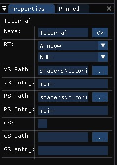
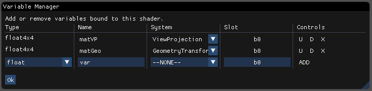

# Tutorial
In this tutorial I will show you the basics of SHADERed while creating a simple shader.

### Create a project
We will start from a completely empty project. Open SHADERed and click on `File `&rightarrow;` New `&rightarrow;` Empty` option.
SHADERed will ask you to choose a location to save your newly created project. Once you select the location
we will have a completely empty project and we can start working on our shader.

### Shader pass
Each shader has to be assigned to a shader pass. Shader pass is just a draw call with one vertex and pixel shader set.
Everything under the shader pass will be rendered only using those shaders. Before creating a shader pass we should
create two empty shader files. We can do that using the `File `&rightarrow;` Create shader file` option. It will prompt us to
pick a name and location. We will name them `tutorialVS.hlsl` and `tutorialPS.hlsl` and save them in the project directory.

After that, we can create a shader pass object. Do that by clicking on a `Project `&rightarrow;` Create `&rightarrow;` Pass` option.
A dialog window will ask you to enter this shader pass' name, paths to your shaders and a shader `entry`. Shader `entry` is just
a name of the function in which your shader program starts.


You can change those values later by right clicking on your shader pass and clicking on
the `Properties` button. The shader pass will open in your property viewer window.



Notice that we also have another option in the property viewer that we didn't have while
creating the shader pass. That option is called "RT" (Render Texture). It allows binding multiple render
textures to one shader pass.

### 3D objects
After we have set the shader pass properties, we can add 3D objects to the scene.
We do that by right clicking on the shader pass and selecting `Add `&rightarrow;` Geometry` (NOTE: you can also create a 3D model and a render state). A popup window
will ask you to enter item name, geometry type and the size of your geometry item. You can
enter anything as the item name (there mustn't exist an item with the same name though).
There are plenty of geometry types that you can pick from. In this tutorial we will go with
the cube. Leave the size at (1,1,1).


Since SHADERed is still a fairly new program it may crash unexpectedly so you should
probably save your project every now and then so that you don't lose your progress (it
doesn't crash often/it doesn't crash at all but please report any crashes/bugs
that occur). You can save your project using `File` &rightarrow; `Save` option
or pressing the shortcut (that you can change in the options) `CTRL+P+S` (you can set it to be 
equal to `Editor.Save` shortcut).

Notice that nothing is being rendered even though we have added a 3D object to the scene.
That is because we haven't added any code to the shaders and we haven't set up shader variables.

### Shader code
After setting up the scene, double click on the shader pass to open shaders in the code
editor (or right click &rightarrow; `Edit Code`).
You can start writing your shader code. You can just copy and paste this vertex shader
code:
```HLSL
cbuffer cbPerFrame : register(b0)
{
	float4x4 matVP;
	float4x4 matGeo;
};

struct VSInput
{
	float3 Position : POSITION;
	float3 Normal : NORMAL;
};

struct VSOutput
{
	float4 Position : SV_POSITION;
	float4 Color : COLOR;
};

VSOutput main(VSInput vin)
{
	VSOutput vout = (VSOutput)0;

	vout.Position = mul(mul(float4(vin.Position, 1.0f), matGeo), matVP);
	vout.Color = 1;

	return vout;
}
```

You can also copy and paste this pixel shader:
```HLSL
struct PSInput
{
	float4 Position : SV_POSITION;
	float4 Color : COLOR;
};

float4 main(PSInput pin) : SV_TARGET
{
	return pin.Color;
}
```

Hit `CTRL+F5` (recompile the whole project) or `F5` (recompile the selected shader). Notice that
there is still nothing being displayed on the preview window. That is because the
vertex shader is using variables in the constant buffer (cbuffer) that we haven't set.

### Variables
You can send custom variables to the shader, edit them and see the results in real time
without needing to recompile your shaders or restart your program.

Right click on your shader pass &rightarrow; `Variables`. A window for creating variables  will open.
Choose the type of your variable and enter its name (**NOTE: variable names are important** - a variable named matView in Variable Manager must also be named matView in the shader code).
The system column allows you to choose some type of the value that SHADERed will
automatically update (time elapsed, cursor position, view matrix, etc...). If it is 
set to `--NONE--` you can enter your own variable value.

In this tutorial we will add two matrices: ViewProjection and GeometryTransform.



### Result
After hitting CTRL+F5 you will see your result displayed in preview window.

**NOTE**: You can drag your cursor around preview window while holding right
mouse button pressed to rotate the camera around the origin. Or use your scroll wheel
to move forward/backwards. Left click on an object to select it. Left click on an empty 
part of a preview window (or use shortcut) to deselect an item.


### HLSL
You don't have to do anything special to write HLSL shaders. They even work on Linux. Just make sure that your
shader file ends with the specific extension (.hlsl &rightarrow;
that can be changed in options and is located under "General" tab).

**HLSL geometry shaders currently don't work - [issue link](https://github.com/KhronosGroup/glslang/issues/1660)**

# Build your own theme
Create an `.ini` file. Under `[general]` write the name of your theme and the version. Also, there is an
option to set the text editor theme. Set `editor` variable to "Dark"/"Light" to use built-in code editor
themes or set it to "Custom" and then build your own theme for the code editor.

Under the `[style]` group you can change all the members of the ImGuiStyle class. Here is the
exact list of all of the variables that you can play with:
```
Alpha, WindowPaddingX, WindowPaddingY, WindowRounding, WindowBorderSize, WindowMinSizeX,
WindowMinSizeY, WindowTitleAlignX, WindowTitleAlignY, ChildRounding, ChildBorderSize,
PopupRounding, PopupBorderSize, FramePaddingX, FramePaddingY, FrameRounding, FrameBorderSize,
ItemSpacingX, ItemSpacingY, ItemInnerSpacingX, ItemInnerSpacingY, TouchExtraPaddingX,
TouchExtraPaddingY, IndentSpacing, ColumnsMinSpacing, ScrollbarSize, ScrollbarRounding,
GrabMinSize, GrabRounding, TabRounding, TabBorderSize, ButtonTextAlignX, ButtonTextAlignY,
DisplayWindowPaddingX, DisplayWindowPaddingY, DisplaySafeAreaPaddingX,
DisplaySafeAreaPaddingY, MouseCursorScale, AntiAliasedLines, AntiAliasedFill, CurveTessellationTol
```

To change the actual colors of the UI, modify these variables in the `[colors]` group:
```
Text, TextDisabled, WindowBg, ChildBg, PopupBg, Border, BorderShadow, FrameBg, FrameBgHovered,
FrameBgActive, TitleBg, TitleBgActive, TitleBgCollapsed, MenuBarBg, ScrollbarBg, ScrollbarGrab,
ScrollbarGrabHovered, ScrollbarGrabActive, CheckMark, SliderGrab, SliderGrabActive, Button,
ButtonHovered, ButtonActive, Header, HeaderHovered, HeaderActive, Separator, SeparatorHovered,
SeparatorActive, ResizeGrip, ResizeGripHovered, ResizeGripActive, Tab, TabHovered, TabActive,
TabUnfocused, TabUnfocusedActive, DockingPreview, DockingEmptyBg, PlotLines, PlotLinesHovered,
PlotHistogram, PlotHistogramHovered, TextSelectedBg, DragDropTarget, NavHighlight, NavWindowingHighlight,
NavWindowingDimBg, ModalWindowDimBg, ComputePass, OutputError, OutputWarning, OutputMessage
```
All of these variables under the `[colors]` have to have 4 float values in the range [0.0, 1.0] splitted with the comma.

To change the actual colors of the text editor (if you have set variable `editor` to `Custom`), modify these variables in the `[editor]` group:
```
Default, Keyword, Number, String, CharLiteral, Punctuation, Preprocessor, Identifier,
KnownIdentifier, PreprocIdentifier, Comment, MultiLineComment, Background,
Cursor, Selection, ErrorMarker, Breakpoint, LineNumber, CurrentLineFill, 
CurrentLineFillInactive, CurrentLineEdge, ErrorMessage
```
These too have to have a 4 float values in the range [0.0, 1.0] splitted with the
comma.

# FAQ
## How do audio files send data to shaders?
Each audio file has a 512x2 texture. First row contains frequency values
while second row contains sample values.