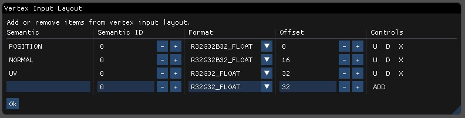

# Tutorial
In this tutorial I will show you the basics of SHADERed while creating a sobel shader. As I am still learning about
shaders, the limits of this tool havent been pushed so feel free to post and send your creations to me.

### Project creation
We will start from an completely empty project. Open SHADERed and click on `File `&rightarrow;` New `&rightarrow;` Empty` option.
SHADERed will ask you to choose a location for your newly created project. Once you pick select the location
we will have a completely empty project and we can start working on our shader.

### Shader pass
Each shader has to be assigned to a shader pass. Shader pass is just a draw call with one vertex and pixel shader set.
Everything under the shader pass will be rendered only using that shader. Before creating a shader pass we should
create two empty shader files. We can do that using the `File `&rightarrow;` New shader` option. It will prompt us to
pick a name and location. We will name them `tutorialVS.hlsl` and `tutorialPS.hlsl` and save them in the project directory.

After that, we can create a shader pass. Do that by clicking on a `Project `&rightarrow;` Create `&rightarrow;` Pass` option.
A dialog window will ask you to enter this shader pass' name, paths to your shaders and a shader `entry`. Shader `entry` is just
a name of the function in which your shader program starts.


You can change those values later by right clicking on your shader pass and clicking on
the `Properties` button. The shader pass will be opened in your property viewer window.


Notice that we also have another option in the property viewer that we didn't have while
creating the shader pass. That option is called "RT". It allows binding multiple render
textures to one shader pass.

### 3D objects
Anyway, after we have set the shader pass properties we can add 3D objects to the scene.
We do that by selecting the shader pass which will be used for rendering our 3D object
and right clicking on it. Select `Add `&rightarrow;` Geometry` (NOTE: there are plenty
of other options such as: WAVEFRONT/.obj model and various render states). A popup window
will ask you to enter item name, geometry type and the size of your geometry item. You can
enter anything as the item name (there mustn't exist an item with the same name though).
There are plenty of geometry types that you can pick from. In this tutorial we will go with
the cube. Leave the size at (1,1,1).


Since SHADERed is still a fairly new program it may crash unexpectedly so you should
probably save your project every now and then so that you don't lose your progress (it
doesn't crash often but it sometimes does unexpectedly - please report any crashes/bugs
that happen to you). You can save your project using `File` &rightarrow; `Save` option
or pressing the shortcut (that you can change in the options) `CTRL+P+S`.

Notice that nothing is being rendered even though we have added a 3D model to the scene.
First, we haven't added any code to the shaders. Second, we need to set up input layout
and shader variables. Input layout is the format of vertex buffer that we are sending
to the shader. It is currently useless as both built-in geometry and .obj models use
the same vertex data layout. Modifiable input layouts might become more useful in future
when we add possibility to create custom buffers. Right click on the shader pass and 
select `Input layout` option to access the window for creating the input layout.
Here is the input layout for geometry's and .obj model's vertex buffers:



### Shader code
After setting up the scene, double click on the shader pass to open the shader code
editor (or right click &rightarrow; `Edit Code`). Two windows will probably open separately
and not docked. Just grab those windows and dock them anywhere you want.
You can start writing your shader code. You can just copy and paste this vertex shader
code:
```c++
cbuffer cbPerFrame : register(b0)
{
	float4x4 matVP;
	float4x4 matGeo;
};

struct VSInput
{
	float3 Position : POSITION;
	float3 Normal : NORMAL;
};

struct VSOutput
{
	float4 Position : SV_POSITION;
	float4 Color : COLOR;
};

VSOutput main(VSInput vin)
{
	VSOutput vout = (VSOutput)0;

	vout.Position = mul(mul(float4(vin.Position, 1.0f), matGeo), matVP);
	vout.Color = 1;

	return vout;
}
```

You can also copy and paste this pixel shader:
```c++
struct PSInput
{
	float4 Position : SV_POSITION;
	float4 Color : COLOR;
};

float4 main(PSInput pin) : SV_TARGET
{
	return pin.Color;
}
```

Hit `CTRL+F5` (recompile the whole project) or `F5` (recompile the shader). Notice that
there is still nothing being displayed on the preview window. That is because the
vertex shader is using variables in constant buffer (cbuffer) that we haven't set.

### Variables
You can send custom variables to the shader. Edit them and see the results in real time
without needing to recompile your shaders.

Right click on your shader pass &rightarrow; `Variables` and then select the stage to
which you want to bind your variables. A window will open for creating variables.
Choose the type of your variable and enter its name (NOTE: variable name doesn't have
effect on anythings - it is there only so that you and the user know what it does).
The system column allows you to choose some type of value that the SHADERed will
automatically update (time elapsed, cursor position, view matrix, etc...). If it is 
set to `--NONE--` you can enter your own variable value.

In this tutorial we will only add two matrices: ViewProjection and GeometryTransform.


### Result
After hitting CTRL+F5 you will see your result displayed in preview window:


### GLSL
You don't have to do anything special to write GLSL shaders. Just make sure that your
shader files end with the specific extension (.vert for vertex, .frag for fragment and
.geom for geometry shaders &rightarrow; these can be changed in options and are a located
under project tab).

# Build your own theme
steps

# Converting ShaderToy shaders
steps
